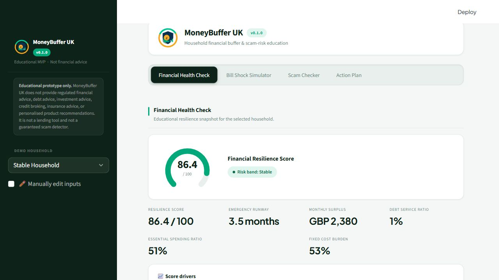
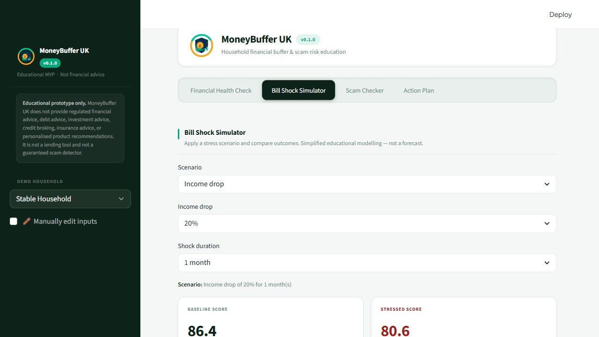
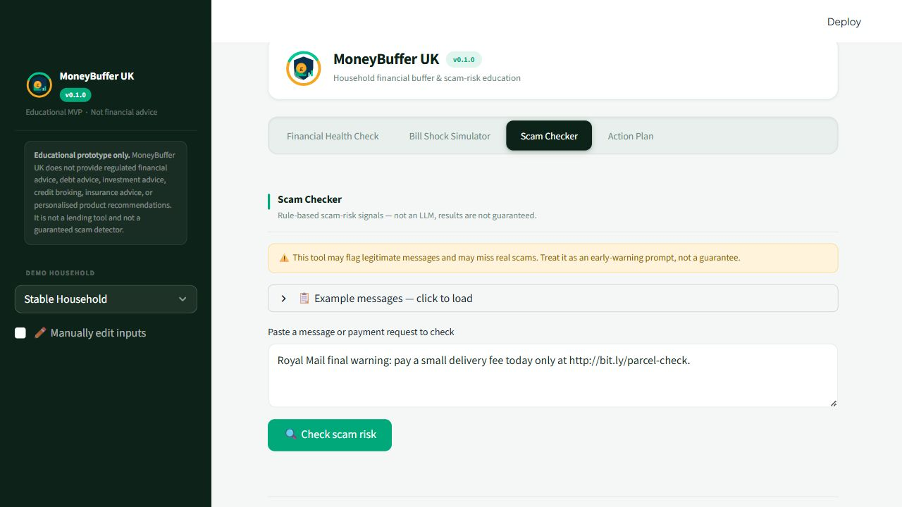
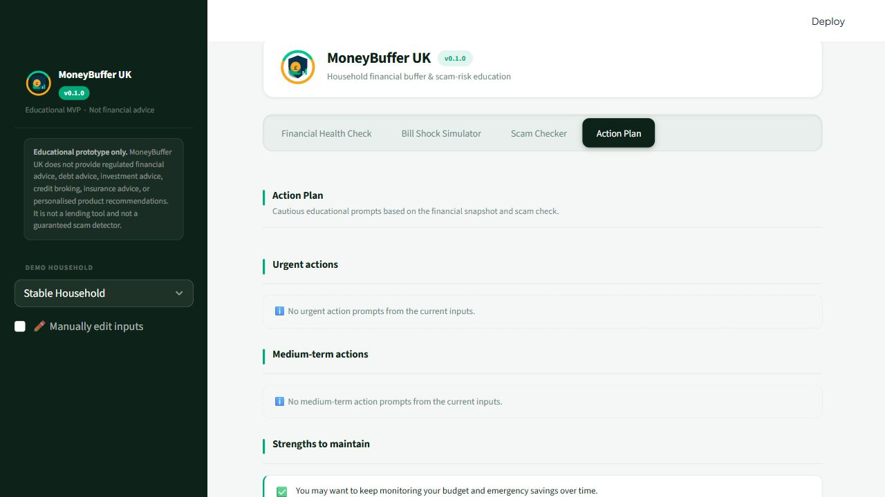
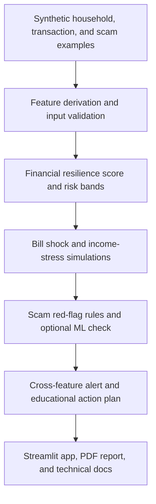

# MoneyBuffer UK — Financial Resilience & Scam Risk Checker

**Created by:** Muhammad Shoaib Safridi  
**Freelance / collaboration enquiries:** [safridi@gmail.com](mailto:safridi@gmail.com)  
**GitHub:** [drmshoaib](https://github.com/drmshoaib)<br>
**Live app:** [moneybuffer-uk.streamlit.app](https://moneybuffer-uk.streamlit.app/)

[](https://www.python.org/)
[](#licence)
[](tests/)
[](https://streamlit.io/)

MoneyBuffer UK is an educational public-interest fintech tool that helps households understand their financial buffer, simulate bill shocks, and identify scam-risk warning signs.

The project is designed as an explainable Streamlit MVP. It uses synthetic household data, transparent scoring rules, and cautious educational wording so that users can explore financial pressure and scam-risk signals without the app making regulated recommendations.

For a deeper technical walkthrough of the architecture, tools, testing strategy, and engineering decisions, see [TECHNICAL_README.md](TECHNICAL_README.md).

## Disclaimer

MoneyBuffer UK is an educational prototype only. It is not financial advice, not debt advice, not investment advice, not a lending tool, not a credit decisioning system, and not a guaranteed scam detector.

Outputs should be treated as general educational information and prompts for reflection. Users should verify important information independently and contact qualified professionals, regulated firms, public services, or trusted support organisations where appropriate.

The deployed app uses synthetic demo data by default and does not require secrets, API keys, or external data services.

For a full discussion of intended uses, prohibited uses, fairness risks, data policy, model limitations, and planned mitigations, see [RESPONSIBLE_AI.md](RESPONSIBLE_AI.md).

## Why This Matters

Many UK households are navigating cost-of-living pressure, higher bills, rent or mortgage stress, limited emergency savings, and growing exposure to fraud and scams. Small shocks can quickly affect resilience, especially where savings are low or debt repayments already consume a large share of income.

At the same time, scam attempts often use pressure, impersonation, suspicious links, risky payment methods, or requests to move money quickly. MoneyBuffer UK explores how public-interest data science can support consumer protection by making these risks easier to understand in a clear, explainable way.

## Features

- **Financial resilience score**: an explainable 0-100 score based on household budget pressure, debt service, savings runway, surplus, and credit dependency.
- **Emergency runway**: estimates how many months of essential spending could be covered by current savings.
- **Bill shock simulation**: models income drops, rent or mortgage increases, energy bill increases, unexpected expenses, and debt or mortgage payment increases.
- **Scam-risk checker**: applies transparent rule-based checks for urgency, secrecy, impersonation, suspicious links, risky payment methods, off-platform requests, investment scam phrases, and invoice redirection signals.
- **Experimental ML proof-of-concept**: optional TF-IDF + logistic regression scam probability trained only on synthetic examples and not used as the primary scam-risk output.
- **Action plan**: generates cautious educational prompts grouped into urgent, medium-term, and positive actions.
- **Cross-feature alert**: when financial vulnerability and high scam-risk indicators appear together, a combined notice highlights the compounded risk of a mistaken payment.
- **Synthetic household profiles**: includes UK-style fictional archetypes such as Stable Household, Payday Pressure, High Debt Burden, Irregular Income Worker, Low Savings Renter, and Mortgage Rate Shock Household.

## UI Design

The app UI is adapted from the MoneyBuffer UK HTML prototype.
It uses the following design system:

- **Colour palette** — navy `#0D2218`, teal `#00A87A`, gold `#F5A623`,
  light background `#F4F7F5`
- **Typography** — Plus Jakarta Sans (loaded from Google Fonts when
  online; falls back to Inter / Segoe UI / system-ui offline)
- **Logo** — custom inline SVG shield/wallet/pound icon;
  place a PNG version at `assets/logo_moneybuffer.png` to use it
  in sidebar or header via `st.image`
- **Theme module** — `src/moneybuffer/ui/theme.py` contains
  `inject_brand_css()` and all HTML component helpers
  (gauge, driver bars, cards, badges, action items)

## App Screenshots

Current Streamlit screenshots:









## Workflow



## Technical Architecture

The app uses a `src`-based Python project layout.

```text
src/moneybuffer/
|-- data_generation/
|   |-- households.py        # Synthetic UK-style household profiles
|   |-- transactions.py      # Synthetic monthly transaction generation
|   `-- scam_messages.py     # Synthetic scam and legitimate message examples
|-- resilience/
|   |-- features.py          # Derived household resilience metrics
|   |-- score.py             # 0-100 resilience scoring
|   |-- bands.py             # Stable, Watch, Vulnerable, Critical bands
|   `-- explanations.py      # Plain-English score explanations
|-- stress_testing/
|   |-- income_shocks.py     # Income drop scenarios
|   |-- bill_shocks.py       # Bill and one-off expense shocks
|   `-- scenario_engine.py   # Scenario orchestration and comparison outputs
|-- scams/
|   |-- rules.py             # Transparent scam red-flag rules
|   |-- classifier.py        # Rule-based risk score and scam type
|   |-- ml_model.py          # Optional TF-IDF + logistic regression classifier
|   `-- explanations.py      # Plain-English scam-risk explanations
|-- recommendations/
|   `-- action_engine.py     # Educational action-plan generation
`-- reporting/
```

The Streamlit interface lives in:

```text
app/streamlit_app.py
```

## Methodology

For a fuller explanation of the score rationale, assumptions, limitations, and future calibration plan, see [docs/scoring_rationale.md](docs/scoring_rationale.md).

### Financial Resilience Score

The resilience engine derives household-level features including:

- essential spending
- essential spending ratio
- debt service ratio
- monthly surplus
- emergency runway months
- credit dependency ratio
- fixed cost burden

These features are converted into transparent sub-scores from 0 to 100:

- emergency runway score
- essential spending score
- debt service score
- surplus score
- credit dependency score

The overall resilience score is a weighted blend:

```text
0.30 * emergency_runway_score
+ 0.20 * essential_spending_score
+ 0.20 * debt_service_score
+ 0.20 * surplus_score
+ 0.10 * credit_dependency_score
```

Scores are clipped between 0 and 100.

### Risk Bands

Financial resilience scores are mapped to bands:

| Score | Band |
|---:|---|
| 75-100 | Stable |
| 55-74 | Watch |
| 35-54 | Vulnerable |
| 0-34 | Critical |

Scam-risk scores are mapped to:

| Score | Band |
|---:|---|
| 0-20 | Low |
| 21-45 | Medium |
| 46-70 | High |
| 71-100 | Severe |

### Scam Rules

The scam checker is rule-based and does not rely on an LLM. It detects red flags such as:

- urgency language
- secrecy requests
- risky payment methods
- off-platform marketplace requests
- impersonation cues
- suspicious or shortened links
- investment scam phrases
- invoice or bank-detail change requests

Each detected red flag contributes to a transparent risk score and explanation.

### Optional ML Scam Classifier

The project also includes an optional lightweight machine-learning classifier:

- TF-IDF text features
- logistic regression binary label: `scam` or `legitimate`
- optional scam category estimate where feasible
- synthetic-demo evaluation metrics: accuracy, precision, recall, F1, and confusion matrix

The optional ML classifier is a proof of concept only. It is not trained on a sufficiently large or representative real-world scam corpus and is not used as the primary scam-risk output. It does not replace the rule-based scam checker and should not be treated as a guaranteed scam detector.

### Stress Testing

The bill shock simulator applies simple scenario transformations to a household profile, then recalculates resilience. Current scenarios include:

- income drops of 20%, 40%, or 100%, with 1, 3, 6, or 12 month duration options
- rent or mortgage increases of 5%, 10%, or 15%
- energy bill increases of GBP 50, GBP 100, or GBP 150
- one-off unexpected expenses of GBP 300, GBP 500, GBP 1,000, GBP 1,500, GBP 2,000, or GBP 3,000
- debt or mortgage payment increases
- compound scenarios combining income, rent or mortgage, energy, unexpected expense, and debt or mortgage payment shocks

The app compares baseline and stressed scores, bands, monthly surplus, and emergency runway.

## Datasets

The MVP uses synthetic data only. It does not contain real customer records, real bank transactions, real personal data, or real scam victim data.

The project is informed by public context sources that could guide future validation and research:

- FCA Financial Lives Survey
- UK Finance Annual Fraud Report
- ONS household, inflation, and cost-of-living data
- Bank of England statistics

Future versions may use public aggregate datasets, open data, or user-uploaded local files with appropriate privacy safeguards.

For a full explanation of why synthetic data is used, what the archetypes cover, which public sources should anchor future calibration, and a structured benchmark gap table, see [docs/synthetic_data_benchmark.md](docs/synthetic_data_benchmark.md).

## Installation

Clone the repository:

```bash
git clone https://github.com/drmshoaib/moneybuffer-uk.git
cd moneybuffer-uk
```

Create and activate a virtual environment:

```bash
python -m venv .venv
```

On macOS or Linux:

```bash
source .venv/bin/activate
```

On Windows PowerShell:

```powershell
.\.venv\Scripts\Activate.ps1
```

Install dependencies:

```bash
pip install -r requirements.txt
```

`requirements.txt` is intentionally runtime-only for Streamlit Community Cloud.
Development tools such as pytest, ruff, and mypy live in the optional
`.[dev]` dependency group in `pyproject.toml`.

Run the Streamlit app:

```bash
streamlit run app/streamlit_app.py
```

Train and evaluate the optional synthetic scam classifier:

```bash
python scripts/train_scam_classifier.py
```

## Streamlit Community Cloud Deployment

MoneyBuffer UK can be deployed on Streamlit Community Cloud using the repository root and the following main file path:

```text
app/streamlit_app.py
```

The app creates deterministic synthetic demo CSV files if they are missing, so no private data files are required for deployment. See [DEPLOYMENT.md](DEPLOYMENT.md) for the full deployment checklist.

## Developer Commands

Install the project and all development tools:

```bash
make install
# equivalent: pip install -e ".[dev]"
```

| Command | What it does |
|---|---|
| `make install` | Install project + dev dependencies in editable mode |
| `make run` | Start the Streamlit app locally |
| `make test` | Run the full pytest suite |
| `make lint` | Check code style with ruff |
| `make format` | Auto-format code with ruff |
| `make typecheck` | Run mypy over `src/` |
| `make check` | Run lint + typecheck + test in sequence |

Run everything in one command before pushing:

```bash
make check
```

### Running steps individually

```bash
ruff check .           # lint
ruff format --check .  # format check (CI mode)
mypy src               # type check
pytest                 # tests
```

## Continuous Integration

The repository includes a GitHub Actions workflow at `.github/workflows/test.yml`.
It runs automatically on every push and pull request, executing ruff, mypy, and pytest
against Python 3.11.

## Roadmap

- CSV upload for users to explore their own local budget data.
- Improved synthetic household and transaction generator.
- TF-IDF scam classifier as an explainable baseline model.
- FastAPI backend for scoring and scenario APIs.
- Mobile app version.
- Report export with clearer educational summaries.
- Score calibration against FCA Financial Lives Survey and ONS distributions (see [RESPONSIBLE_AI.md](RESPONSIBLE_AI.md) and [docs/synthetic_data_benchmark.md](docs/synthetic_data_benchmark.md)).
- Per-archetype fairness diagnostics (see [RESPONSIBLE_AI.md](RESPONSIBLE_AI.md)).
- Scam checker validation set using published Action Fraud and FCA examples.

## Licence

No licence has been selected yet. MIT and Apache-2.0 are both reasonable options for an open public-interest prototype, but the project owner should choose before a `LICENSE` file is added.
